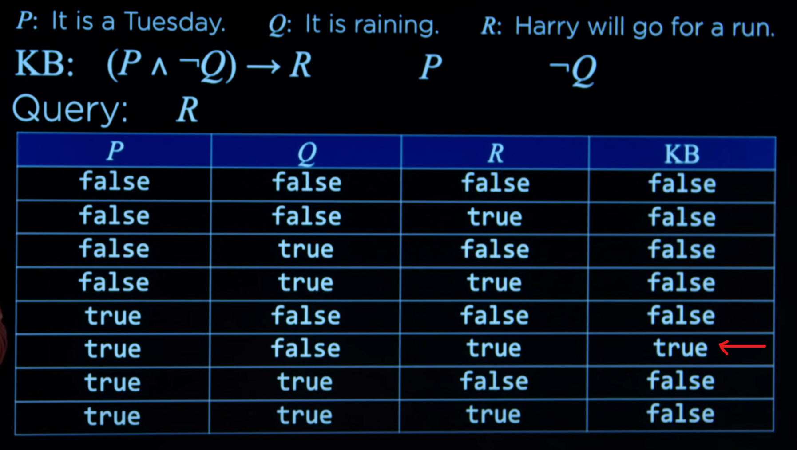

# Lec-1: Knowledge
---
**Init:** 
- Knowledge based reasoning.
- Sentence: assertion about the world in a knowledge representation
- Proposition Symbols:
  - P: It is raining,
  - Q: Harry visited Hagrid today, etc.

- Logical Connectives:
  - not: &not;
  - and: &and;
  - or: &or;
  - implication: -->
    - P --> Q : P implies Q.
    - _False_: only when P is True, but Q is False.
  - biconditional: <-->
    - P <--> Q : P if and only iff Q.
    - _True_: when both P and Q are False or both are True
    - _False_: when P and Q are in different True/False state.

- Model:
  - Assigns a truth value to every propositional word/phrase.

- Knowledge Base:
  - A set of sentences known by a knowledg-based agent.

- Entailment: &#8872;
  - $\alpha \models \beta$ : $\alpha$ entails $\beta$.
  - In every model (or world) in which sentence $\alpha$ is true, sentence $\beta$ is also true.

- **Inference:** 
> _Given Info:_
> - If it didn't rain, Harry visited Hagrid today.
> - Harry visited Hagrid or Dumbledore today, but not both.
> - Harry visited Dumbledore today.
> 
> _Machine Deduction or **Inference**_:
> - Harry did not visit Hagrid today.
> - It rained today.

### Example:
**Define Proposition Symbols:**
- **P**: _It is a Thursday._
- **Q**: _It is hot outside._
- **R**: _Harry will go for a run._

> Knowledge Base (KB): (P &and; &not; Q) $\rightarrow$ R.  
> Meaning: (It is a Thursday and It is not hot outside) implies/then Harry will go for a run.  
> Inference:  
> - P: True
> - &not; Q: Ture
> - (P &and; &not; Q): True
> - So, R: True. 

### Model Checking:
- To determine if $KB \models \alpha$,
  - Enumerate all possible models.
  - If in every model where KB is true, $\alpha$ is also true, then KB entails $\alpha$.
  - Otherwize, KB does not entail $\alpha$.

